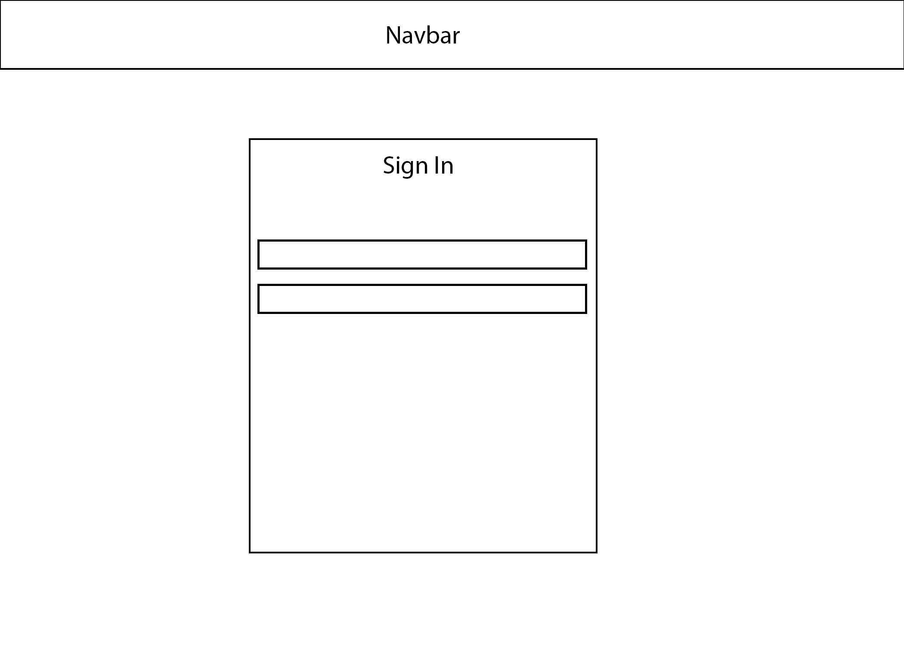
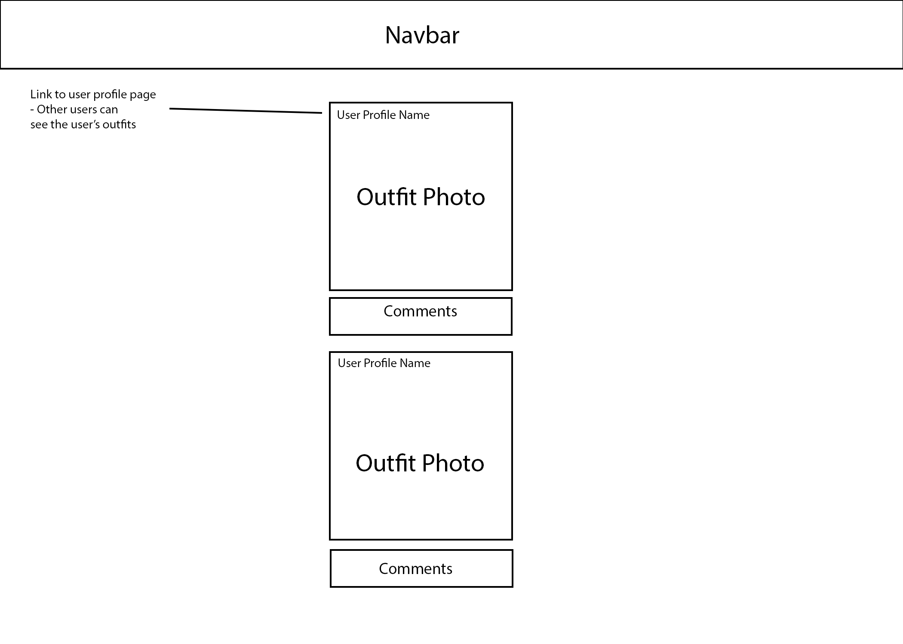
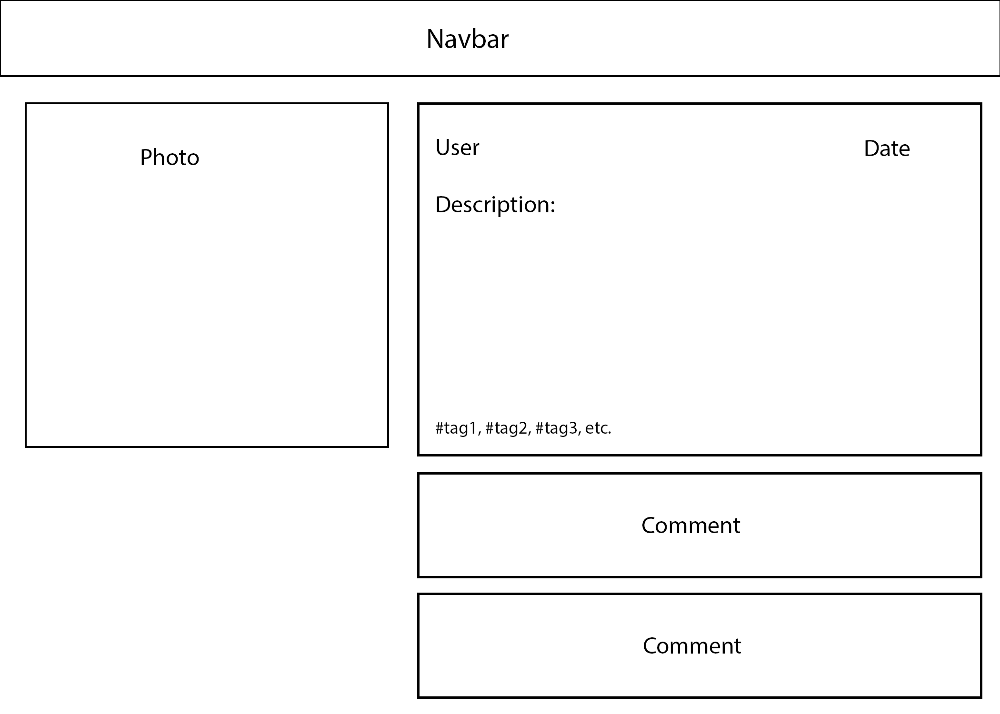
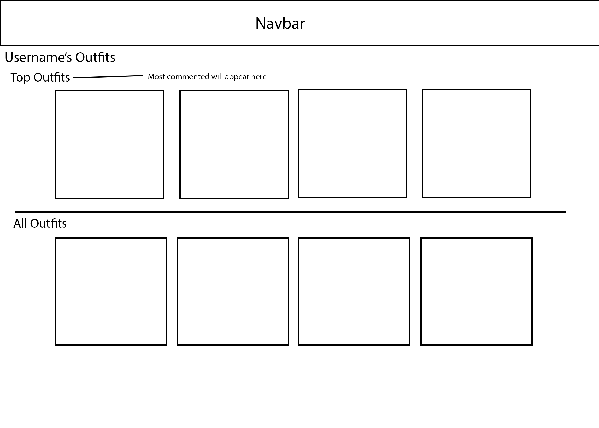

# Check my Fit Client

# User Story:

**As a Public User:**
- navigate through index of looks.
- click on individual looks to view/see other user comments.
- sign up

**As a Logged in User:**
- they will to be able to look through a feed of outfits uploaded by other users
- they will be able to click on individual outfits to see more details, previous comments, & be able to add a comment
- they will be able to upload personal outfits, with a description
- they will be able to their or another users profile page and see a list of their outfits 

# Routes Table:

| Endpoint         | Component | `AuthenticatedRoute`? |
|------------------|-------------------|-------|
| `/sign-up`       | `SignUp`    | No |
| `/sign-in`       | `SignIn`    | No |
| `/fits`  | `Index`     | No |
| `/fits/:fitId`  | `Show`| Yes |
| `/addfit`      | `Create`   | Yes | 
| `/myfits/:userId`  | `Index`| Yes |
| `/change-password` | `ChangePassword`  | Yes |
| `/sign-out`        | `SignOut`   | Yes |

# Wireframe:
## Sign in page:

## Index Page of all the Outfits: 

## Show Page:

## User Profile of Outfits

 

# Approach Taken:
- create restful routes to be able to format an index, edit, show, and delete function
- use axios to pull in data from API to render to the client 
- format pages through react

# Installation Instructions:

# Tech Used:
- HTML
- Javascript
- React
- Boostrap
- CSS
- Axios
- Mongodb
- Mongoose

